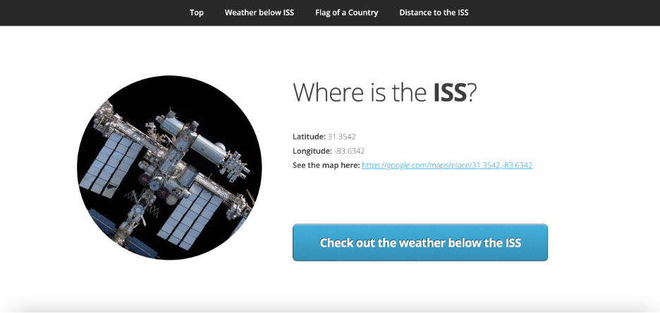
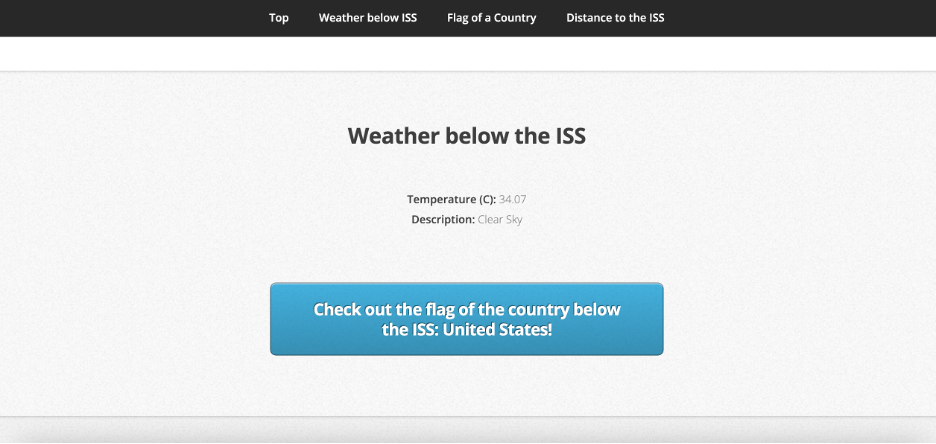
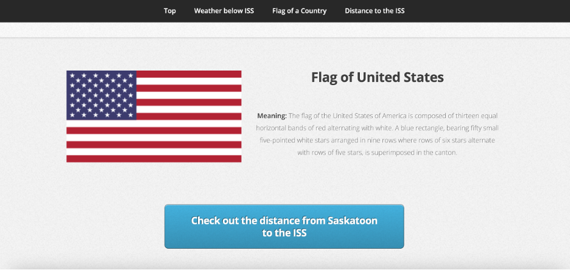
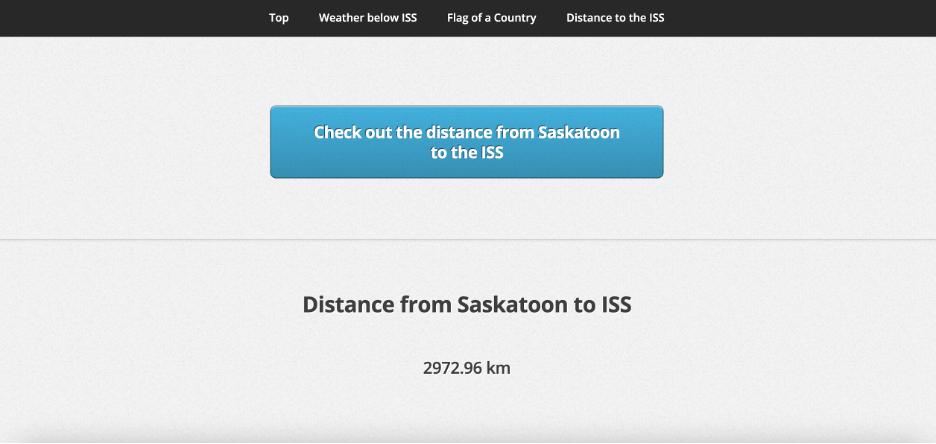
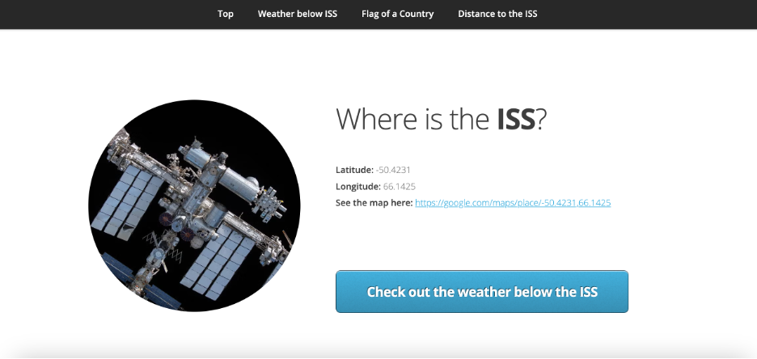
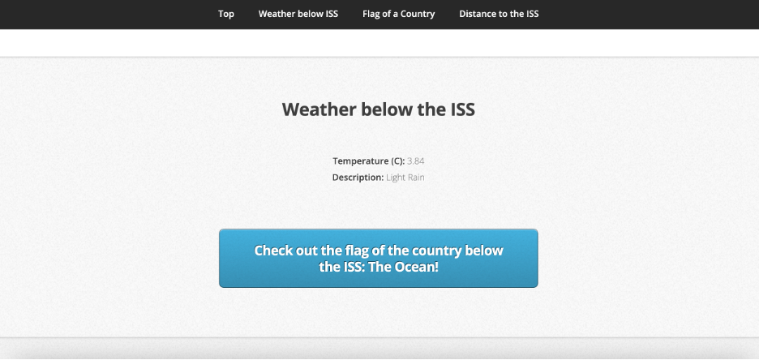
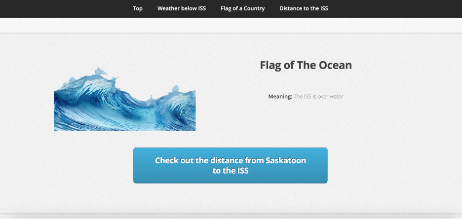
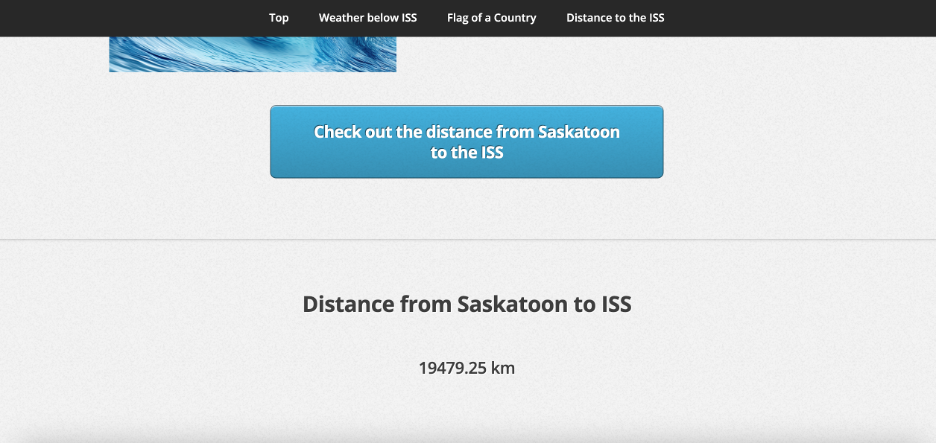

# 
 ISS Tracker Project 

## Introduction & Context

This project is a Flask web application that provides real-time information about the location of the International Space Station (ISS) and various associated details such as the weather conditions at the ISS’s current location, the country (if any) below the ISS, and the distance from the ISS to a fixed point on Earth, in this case, Saskatoon, SK, Canada. The primary motivation behind this project is to utilize various APIs to demonstrate how real-time data can be integrated into a web application to provide meaningful insights.

## Flow of the Data Architecture

The data flow within the project involves multiple API calls to gather and process the required information:

1. **ISS Location API**: The application first calls the Open Notify API to get the current latitude and longitude of the ISS. See [Open Notify API](http://api.open-notify.org/)
2. **Weather API**: With the obtained coordinates, the OpenWeatherMap API is called to retrieve the current weather conditions (temperature and description) at the ISS’s location. See [OpenWeatherMap API](https://openweathermap.org/api)
3. **Country Information API**: If the ISS is over land, the RestCountries API is used to gather the flag and flag-related information for the country beneath the ISS. See [RestCountries API](https://restcountries.com/)
4. **Geolocation Calculation**: The distance from the ISS to Saskatoon, SK, Canada, is calculated using geopy’s distance calculation features.

This structured flow allows the application to dynamically update and display the latest information regarding the ISS, making it a valuable tool for both educational and observational purposes.

[Check this project on Replit](https://replit.com/@grisales1803/Assignment4ConnectedData#country.py)

## Conclusions

This project successfully demonstrates the integration of multiple external data sources into a single web application, showcasing the power of APIs in providing real-time data. By combining Flask, geopy, and various public APIs, we've created an interactive and informative platform that not only tracks the ISS but also provides contextual data such as weather conditions and geographical information. This project highlights the importance of data interoperability and the potential of using such integrations in various applications, from education to entertainment.

## Screenshot of the Webpage

### When the ISS is over a country

### When the ISS is overwater

